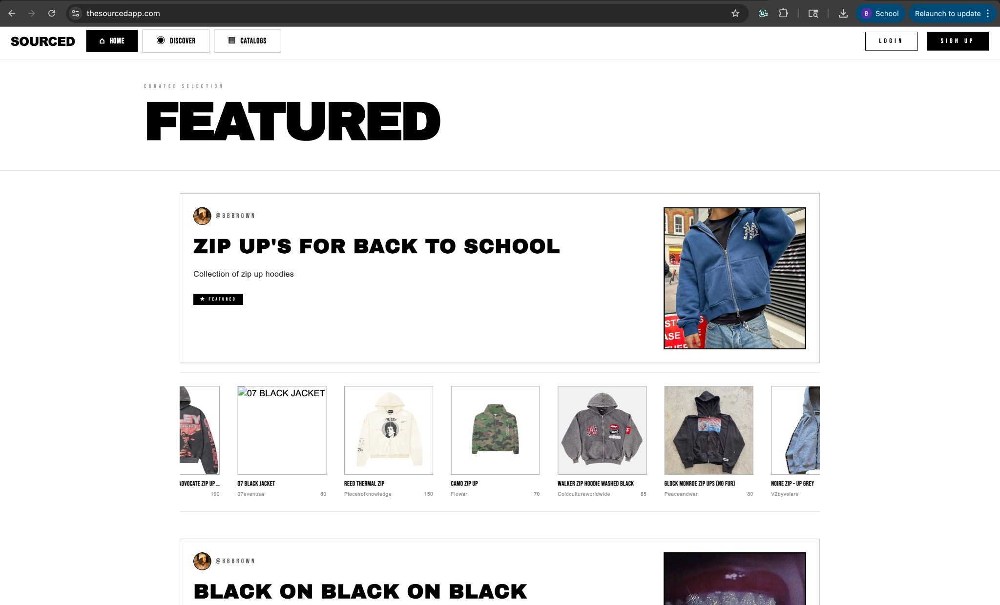
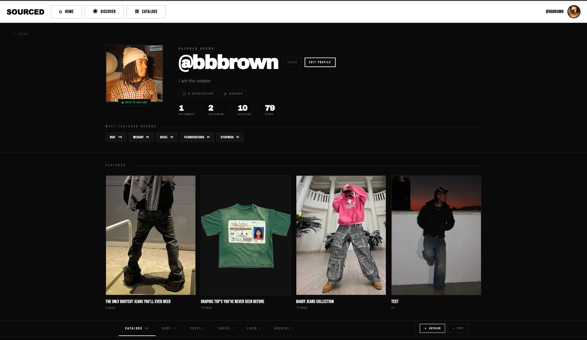
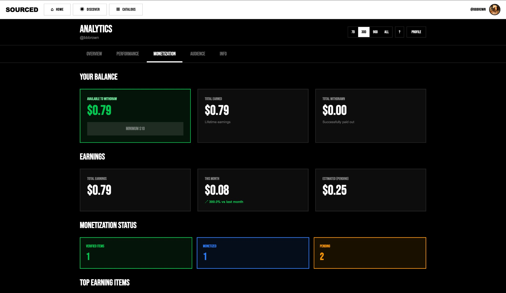
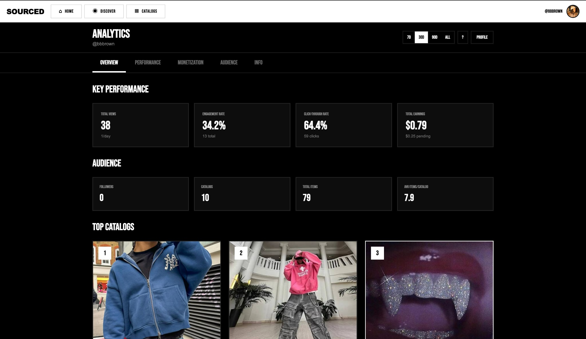

# Sourced

**Creator-first monetization infrastructure for the fashion industry.**

Sourced is a full-stack platform that lets fashion creators build shoppable catalogs, earn affiliate revenue on the products they feature, and get paid out directly — closing the gap between content and commerce for creators who don't have the reach (or patience) for traditional brand deals.

Built and shipped solo, end to end: product design, frontend, backend, database schema, payments, and affiliate network integrations.

🔗 **Live:** [thesourcedapp.com](https://thesourcedapp.com)

## Product

---

## What it does

- **Shoppable catalogs** — creators curate product catalogs tied to their profile, discoverable via a TikTok-style vertical feed and a dedicated discover page
- **Affiliate monetization** — live integrations across Rakuten, CJ, and Impact affiliate networks (including an active Finish Line partnership), with tiered per-click earnings for verified creators
- **Creator payouts** — full earnings pipeline: balance tracking, withdrawal requests, and CashApp payouts
- **Analytics dashboard** — five-tab creator analytics suite (Overview, Performance, Monetization, Audience, Info) covering click-through and earnings performance
- **FTC-compliant disclosure system** — automated affiliate disclosure badges across every surface a monetized link appears (catalog, discover, feed, post)
- **Social auth & onboarding** — Google OAuth via Supabase, slug-based creator URLs (`/@username/catalog-slug`), founder-led onboarding flow for early creators

## Tech stack

| Layer | Tech |
|---|---|
| Frontend | Next.js (App Router), TypeScript, Tailwind CSS |
| Backend | FastAPI (Python), deployed on Render |
| Database / Auth | Supabase (Postgres, Row Level Security, Google OAuth) |
| Payments | Stripe Connect |
| Search | SerpAPI + Playwright-based image search |
| Moderation | OpenAI API for content moderation |

## Engineering highlights

A few problems worth calling out from building this solo:

- **Affiliate tracking at scale** — designed a network-agnostic tracking scheme (`{creatorId}_{itemId}` encoded into each network's native tracking parameters) so click attribution works consistently across three separate affiliate networks with three different APIs.
- **Click-count race conditions** — replaced a naive counter update with a Postgres RPC function (`increment_click_count`) to avoid write conflicts under concurrent traffic, with IP-based fallback tracking for logged-out visitors.
- **Row Level Security done right** — diagnosed and fixed RLS policies silently blocking legitimate cross-user profile updates, using `SECURITY DEFINER` functions instead of loosening security broadly.
- **60fps image interactions** — moved image panning off React state and onto refs + `requestAnimationFrame` after state-driven re-renders were causing visible jank on mobile.
- **Social share correctness** — fixed Open Graph metadata generation for Instagram/iMessage/WhatsApp/Snapchat previews, working around a Next.js 15 requirement that dynamic route `params` be awaited before use.
- **Design system** — built a 13-theme brutalist/editorial visual system from scratch (custom type pairing, color theming, layout language) rather than reaching for a component library default.

## About this build

I designed, built, and shipped Sourced independently while completing my CS degree — covering product decisions, UI/UX, full-stack implementation, third-party integrations (payments, affiliate networks, OAuth), and infrastructure. The commit history here reflects the major milestones of that build, from initial architecture through live affiliate revenue.

**Brennan Brown**
[thesourcedapp.com](https://thesourcedapp.com)
